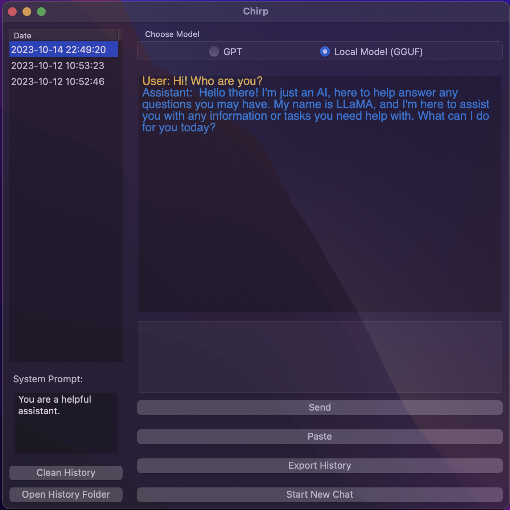

# Chirp

An easy to use interface for local LLMs (LLaMa, Mistral, ...)

## Usage
1. Download GGUF models (e.g., https://huggingface.co/TheBloke/Mistral-7B-Instruct-v0.1-GGUF).
2. First install llama-cpp-python using `pip install llama-cpp-python`
3. SImply run `python Chirp.py`

## Demo
